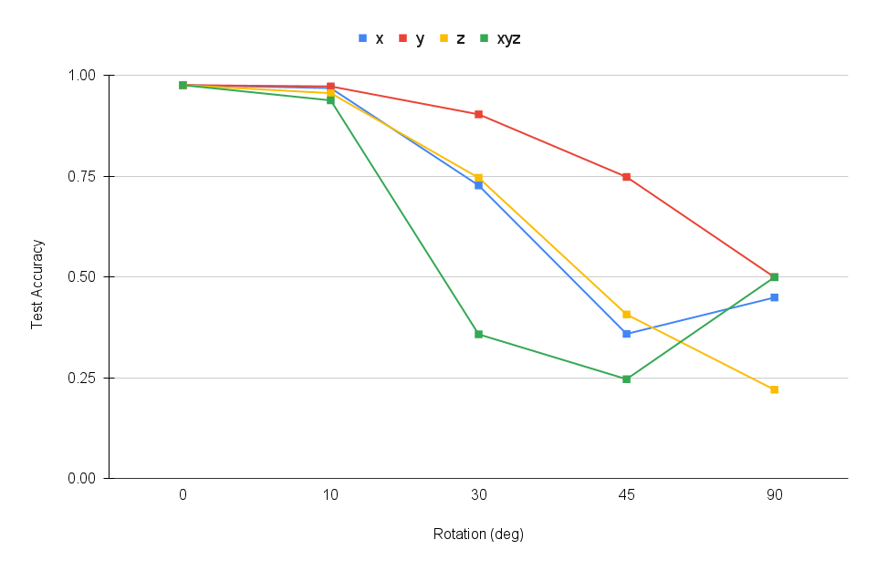
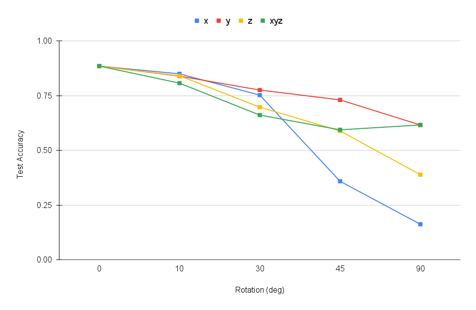

# PointNet

## Overview
Implementation of PointNet-based architecture for classification and segmentation with point clouds.

`models.py` is where the model structures are defined. `train.py` loads data, trains models, logs trajectories, and saves checkpoints. `eval_cls.py` and `eval_seg.py` contain scripts to evaluate model accuracy and visualize segmentation results.


## Data Preparation
Download the zip file (~2GB) from [here](https://drive.google.com/file/d/1wXOgwM_rrEYJfelzuuCkRfMmR0J7vLq_/view?usp=sharing). Put the unzipped `data` folder under the root directory. There are two folders (`cls` and `seg`) corresponding to two tasks, each of which contains `.npy` files for training and testing.

## Classification Model
- Input: points clouds from across 3 classes (chairs, vases, and lamps objects)

- Output: probability distribution indicating predicted classification (Dimension: Batch * Number of Classes)

Run `python train.py --task cls` to train the model, and `python eva_cls.py` for evaluation.

#### Test Accuracy : __97.58%__

#### Results

- Correct Classifications/Predictions
  
| Class | Ground Truth | Prediction | Ground Truth | Prediction | Ground Truth | Prediction |
|-------|--------------|------------|--------------|------------|--------------|------------|
| Chair |  |  |  |  |  |  |
| Vase  |   |   |   |   |   |   |
| Lamp  |    |   |    |    |    |    |

- Incorrect Classifications/Predictions

| Class | Ground Truth | Prediction |
|-------|--------------|------------|
| Chair |  |  |
| Vase  |   |   | 
| Lamp  |    |   |  


#### Interpretation
The overall performance of the classification model is commendable, especially in accurately identifying chairs where it exhibits a high level of precision. 
Nevertheless, there are instances where the model tends to misclassify certain samples, particularly confusing between lamps and vases. 
This suggests the model encounters challenges distinguishing between classes with similar structural characteristics.


## Segmentation Model
- Input: points of chair objects (6 semantic segmentation classes)
- Output: segmentation of points (Dimension: Batch * Number of Points per Object * Number of Segmentation Classes)

Run `python train.py --task seg` to train the model. Running `python eval_seg.py` will save two gifs, one for ground truth and the other for model prediction.

#### Test Accuracy : __88.52%__


#### Results

- Good Segmentations/Predictions

| Ground Truth | Prediction | Ground Truth | Prediction |
|--------------|------------|--------------|------------|
|  |  |  |  |
|  |  |  |  |
|  |  |  |  |


- Bad Segmentations/Predictions

| Ground Truth | Prediction |
|--------------|------------|
|  |  |
|  |  |
|  |  |

#### Interpretation

The model excels in accurately segmenting the various components of a well-defined conventional chair, especially where the different segments like chair legs, backrests, armrests, etc are distinguishably defined. 
However, its performance experiences a decline when faced with unconventional chair designs, particularly those that integrate the legs and base. 
In such instances, the model encounters challenges, often misidentifying a substantial part of the legs as the seat.


## Robustness Analysis

###  Rotating Pointclouds

Evaluating the classification and segmentation models on rotated point-clouds. Point-clouds are either rotated along all x,y, and z axes combined or individually along a single axis.

#### Procedure
   ```
   def rotate_test_data(point_cloud, angles):
        # Convert angles to radians 
        alpha, beta, gamma = np.deg2rad(angles)

        # Define rotation matrices
        Rx = torch.Tensor([[1,         0,           0       ],
                          [0, np.cos(alpha), -np.sin(alpha)],
                          [0, np.sin(alpha),  np.cos(alpha)]]).to(args.device) 
        
        Ry = torch.Tensor([[ np.cos(beta), 0, np.sin(beta)], 
                          [     0,        1,       0     ], 
                          [-np.sin(beta), 0, np.cos(beta)]]).to(args.device)
        
        Rz = torch.Tensor([[np.cos(gamma), -np.sin(gamma), 0],
                          [np.sin(gamma),  np.cos(gamma), 0],
                          [      0,             0,        1]]).to(args.device)

        # Combine rotations
        R_xyz = torch.matmul(Rz, torch.matmul(Ry, Rx))

        rotated_point_cloud = torch.matmul(point_cloud, R_xyz)
        return rotated_point_cloud
```

Before starting the prediction the input test_data (point clouds) is rotated with the desired angles along x,y, and z.

```
    #input point cloud rotation for Robustness Analysis
    angle_x, angle_y, angle_z = 90,0,0
    rotation_angles = (angle_x, angle_y, angle_z) 
    test_data = rotate_test_data(test_data, rotation_angles)
```
#### Visualizations - Classification

Rotation along x, y, and z:

| Class | Ground Truth | 0&deg; | 45&deg; | 90&deg; | 
|-------|--------------|------------|--------------|------------|
| Chair |  |  |  |  | 
| Vase  |   |   |   |   |
| Lamp  |    |   |    |    | 
| Test Accuracy  | -  | __97.58%__ | __24.65%__  |  __49.94%__  | 

Rotation along x only:

| Class | Ground Truth | 0&deg; | 45&deg; | 90&deg; | 
|-------|--------------|------------|--------------|------------|
| Chair |  |  |  |  | 
| Vase  |   |   |   |   |
| Lamp  |    |   |    |    | 
| Test Accuracy  | -  | __97.58%__ | __35.88%__  |  __44.91%__  | 

Test Accuracy with varying rotations (Classification) - 




#### Visualizations - Segmentation

Rotation along x, y, and z:

| Class | Ground Truth | 0&deg; | 45&deg; | 90&deg; | 
|-------|--------------|------------|--------------|------------|
| Example 1 |  |  |  |  | 
| Example 2  |   |   |   |   |
| Example 3  |    |   |    |    | 
| Test Accuracy  | -  | __88.52%__ | __59.40%__  |  __61.60%__  | 

Rotation along x only:

| Class | Ground Truth | 0&deg; | 45&deg; | 90&deg; | 
|-------|--------------|------------|--------------|------------|
| Example 1 |  |  |  |  | 
| Example 2  |   |   |   |   |
| Example 3  |    |   |    |    | 
| Test Accuracy  | -  | __88.52%__ | __35.88%__  |  __16.25%__  | 

Test Accuracy with varying rotations (Segmentation) - 



#### Interpretation
-  In the classification task, an intriguing pattern emerges when point clouds are rotated at angles to 90° along all the axes, even though the final orientation is very similar to the one without rotations, the accuracy of the model falls to half.  Interestingly, when the point clouds are completely inverted, the model's performance improves slightly compared to the 90° rotations.  Another observation was that the accuracy falls drastically when point clouds are only rotated along x compared to other directions, even the combined one. 
  
- In the segmentation task, the model heavily relies on spatial features. Notably, it consistently segments the lower portion of the point cloud as chair legs, even in scenarios involving conventional chair structures.

  

